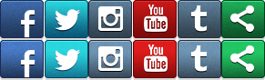
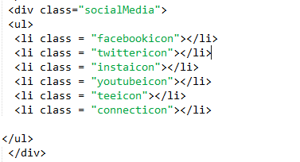
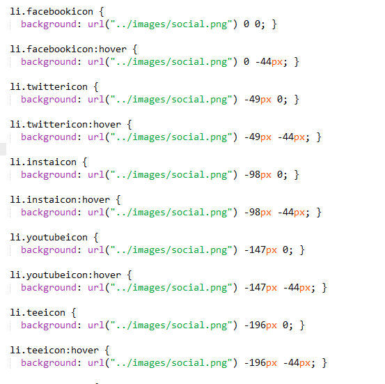
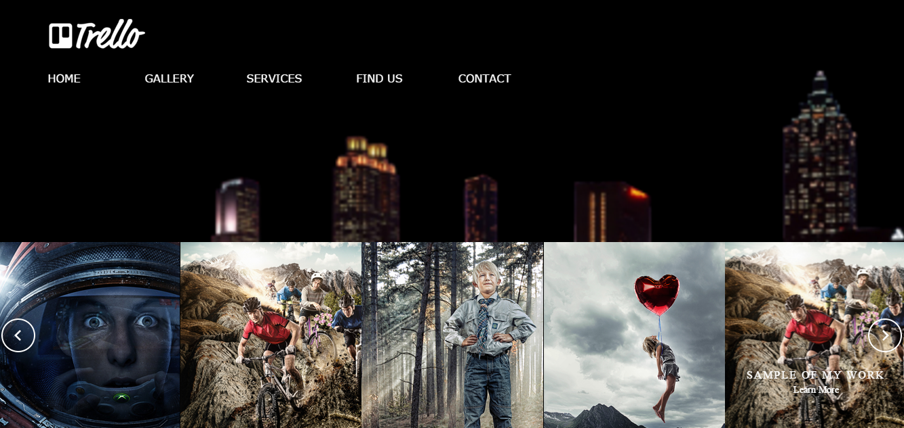

<h1> Trello-Mar-2016</h1>

Trello-Mar-2016 is a Responsive OnePage multi-purpose website template 

<h6> Skills used to build this website: </h6>
<ul>
<li> HTML5 </li>
<li> CSS3 </li>
<li> SASS </li>
<li> JAVASCRIPT </li>
<li> JQUERY </li>
<li> Google map API </li>
<li> CSS Sprites </li>
<li> Owel Carousel plugin </li>

</ul>

<h6> CSS Image Sprites </h6>
An image sprite is a collection of images put into a single image.
A web page with many images can take a long time to load and generates multiple server requests.
Using image sprites will reduce the number of server requests and save bandwidth.
In other words instead of using alot of images to show social media icons on your website  you can use single image that include all the icons you need to use then use CSS Image Sprites to show only parts of the image that include the Icon you want to show
the image below show what an image sprite looks like :

HTML part of image sprites

 

 

 
 The CSS part to achieve image Sprites for social media icons 

 

 

<h6> Mobile First Responsive </h6>

 trello is mobile first responsive which means designing for mobile before designing for desktop or any other device (This will make the page display faster on smaller devices and mobiles). and as the last statistics show that more users view websites on thier mobiles its becoming so important to keep it mobile first. Thankfully CSS3 introduced Media Query which made that possible and easy to be done. 

 @media only screen and (min-width: 800px)

Instead of changing styles when the width gets smaller than 800px, we should change the design when the width gets larger than 800px. This will make our design Mobile First.

<h6>SASS </h6>

 To keep my styling sheets under control it has be done the SASS way  to benefit from variables, nesting and mixins and to keep my style sheets tidy and reusable

<h6>Google Map API </h6>

 Google Map API gives you the power to customise google maps by usig your own Marker icons and add info windows to them to give more info than just a location. and they are very handy when your bussiness has  more than one location and want to view them in one map.  

<h6>UX And Accessibility </h6>
 all colors, background colors, font types and sizes choosen carefully to allow users to have the best experience UX.
<h6>plugin </h6>

The photo slide made using owel carousel plugin.

Click the the screen shot below to visit trello 

  

 the design and layout of trello was inspired by Plum The free HTML Template | Version 1.2  

 Yaqob Salem 

